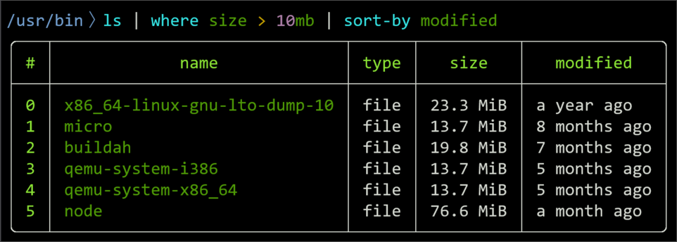

## Tools I use every day

### 1. Nushell

For my money, this is the best shell out there.

Here are 10 key points highlighting what makes Nushell innovative compared to traditional shells like zsh:

1. Structured Data with Tables

   - **Nushell**: Works with structured data natively, representing outputs as tables, lists, and other structured types instead of plain text. This makes it easier to manipulate and analyze data from commands.
   - **zsh**: Outputs are plain text, requiring tools like awk, grep, or cut to parse and transform data.

2. Strong Typing

   - **Nushell**: Employs a strongly-typed system where data types like strings, integers, dates, and JSON are recognized and handled appropriately. This reduces errors when performing operations like arithmetic or filtering.
   - **zsh**: Treats everything as a string, requiring careful parsing and manual type conversion for complex tasks.

3. Built-In Commands for Data Manipulation

   - **Nushell**: Comes with a rich set of built-in commands for filtering, sorting, grouping, and transforming data (e.g., get, select, where, group-by).
   - **zsh**: Relies on external tools like sort, awk, and sed for similar functionality, often requiring verbose and complex syntax.

4. Pipelines Are Data-Aware

   - **Nushell**: Pipelines pass structured data between commands, maintaining its original format (e.g., JSON remains JSON). This makes it seamless to chain operations.
   - **zsh**: Pipelines pass text streams, requiring extra parsing and reformatting at every stage.

5. Consistent Syntax

   - **Nushell**: Offers a consistent syntax for all operations, making scripts and commands easier to read and write. For example, commands like ls | where size > 10kb are intuitive.
   - **zsh**: Has many idiosyncrasies and relies heavily on external tools, leading to less consistent syntax across workflows.

6. Integrated Help and Documentation

   - **Nushell**: Provides inline help (help <command>) and autocompletion for commands and parameters. Its clear, structured output for help is easy to navigate.
   - **zsh**: Relies on traditional man pages or external plugins for enhanced documentation and autocomplete functionality.

7. Cross-Platform Consistency

   - **Nushell**: Designed to behave consistently across platforms (Linux, macOS, Windows) with first-class support for modern systems.
   - **zsh**: While available on multiple platforms, behavior and dependencies may vary, especially on Windows.

8. Better JSON, YAML, and TOML Handling

   - **Nushell**: Reads and manipulates structured formats like JSON, YAML, and TOML natively, making it easy to query and transform configuration files.
   - **zsh**: Requires external tools like jq or yq to handle these formats, often requiring complex syntax.

9. Modern Programming Features

   - **Nushell**: Supports modern shell scripting constructs like variables, loops, and conditionals in a clear, concise syntax. Its scripting capabilities feel more like a programming language.
   - **zsh**: While powerful, zsh scripting can be verbose and inconsistent due to its legacy syntax and reliance on external utilities.

10. Developer-Focused Design

    - **Nushell**: Built with developers in mind, with features like:
    - \*\*Table previews of outputs.
    - \*\*Easy filtering and transformation of command results.
    - \*\*Native LSP (Language Server Protocol) support in some editors for Nushell scripting.
    - **zsh**: Designed as a traditional shell with extensibility but lacks built-in support for many developer-oriented tasks without plugins.

Why It’s Innovative

Nushell rethinks what a shell should be in the modern era, emphasizing data-first workflows, clarity, and ease of use. While zsh excels as a traditional shell with customization and performance, Nushell’s structured data handling, consistency, and built-in tooling represent a significant paradigm shift.

### 2. Helix Text Editor

Helix is a modal text editor that has become my go-to choice for modal
editing. Instead of spending hours and hours fiddling with my neovim config, I am now spending hours trying to get faster and faster with Helix.

Here are 10 key differences between Helix and Vim/Neovim:

1. Modal Editing Paradigm

   - **Helix**: Uses modal editing, like Vim, but with its own keybinding philosophy inspired by Kakoune. It emphasizes selections first and operates on those selections, which is different from Vim’s command-oriented approach.
   - **Vim/Neovim**: Also modal, but commands are primarily executed on the cursor position and require explicit selection for operations like v for visual mode.

2. Selections Over Cursors

   - **Helix**: Every operation starts with a selection. Actions like editing, deleting, or copying always target a selection, even if it’s just the word under the cursor.
   - **Vim/Neovim**: Operations typically start with commands and optionally include motions to determine the range (e.g., dw to delete a word).

3. Out-of-the-Box Features

   - **Helix**: Comes with many features pre-configured, such as syntax highlighting, tree-sitter integration, LSP support, and basic Git integration.
   - **Vim/Neovim**: Highly extensible, but relies on plugins and manual configuration for similar functionality (e.g., nvim-treesitter, nvim-lspconfig).

4. Tree-Sitter Integration

   - **Helix**: Built-in and deeply integrated. Tree-sitter powers syntax highlighting, code navigation, and text objects, making it central to the editor’s functionality.
   - **Vim/Neovim**: Requires nvim-treesitter plugin for similar functionality, and integration is not as deeply tied to the core editor.

5. Multiple Cursors

   - **Helix**: Provides built-in support for multiple cursors, allowing simultaneous edits without additional plugins.
   - **Vim/Neovim**: Lacks native support for multiple cursors. Achieving similar functionality requires plugins like vim-visual-multi or coc.nvim.

6. Configurations

   - **Helix**: Uses a TOML-based configuration file (~/.config/helix/config.toml) and doesn’t rely on scripting for configuration. Configuration is straightforward but less flexible than Vim’s.
   - **Vim/Neovim**: Configurable with its own scripting language (vimrc for Vim) or Lua (for Neovim). Highly extensible but may require more setup.

7. Plugin Ecosystem

   - **Helix**: Does not yet have a plugin system. All functionality is either built-in or not supported. This prioritizes simplicity and reduces bloat.
   - **Vim/Neovim**: Highly extensible with a rich ecosystem of plugins for virtually any feature (e.g., file navigation, debugging, Git integration).

8. Keybinding Philosophy

   - **Helix**: Keybindings are influenced by Kakoune and operate more naturally in a “what-you-see-is-what-you-get” way. For example, most commands act on visible selections.
   - **Vim/Neovim**: Keybindings are powerful but have a steeper learning curve due to many context-dependent commands (d for delete, y for yank, p for paste, etc.).

9. Terminal vs. GUI Support

   - **Helix**: Designed primarily as a terminal-based editor but includes some modern interface features (e.g., LSP diagnostics).
   - **Vim/Neovim**: Works in both terminal and GUI environments (e.g., GVim, Neovide) with more mature GUI integrations.

10. Development Philosophy

    - **Helix**: Aims for simplicity and developer productivity with sensible defaults and no plugins. It’s ideal for users who want power without extensive setup.
    - **Vim/Neovim**: Emphasizes extensibility and customization. With plugins and scripts, it can be tailored to suit nearly any workflow.

These differences highlight how Helix focuses on out-of-the-box productivity, while Vim/Neovim offers greater customization and extensibility at the cost of additional configuration effort.
